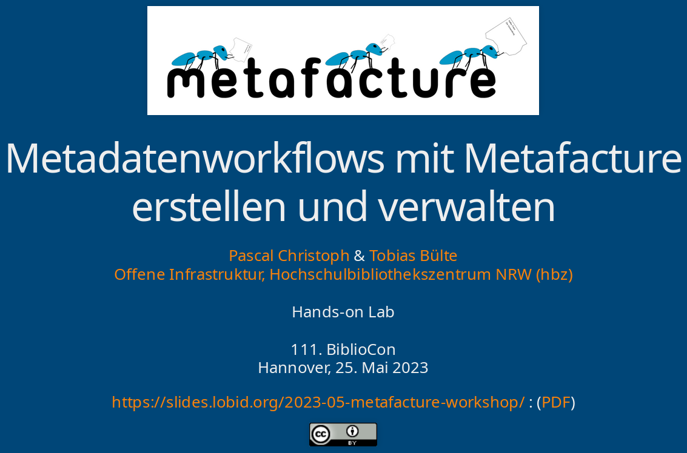

Pascal and Tobias of hbz's Open Infrastrutcure team conducted a 2 hours Metafacture workshop using Fix and Playground at the 111. bibliocon in Hannover. The slides in German can be found at [https://slides.lobid.org/2023-05-metafacture-workshop/](https://slides.lobid.org/2023-05-metafacture-workshop/).
The workshop sparked some objections from Andreas Walker against using an ETL tool - and  we've heard that argument from time to time: if e.g. a DSL
(Domain Specific Language) is rather complex than why not better start to learn a
programmimg language instead? You would be able to do far more then just ETL! See the [discussion at mastodon
(German)](https://openbiblio.social/@andreaswalker/110428877504457581).

It's good to see that there is interest in using
the software.
There were around 20 people and we expect some of them picking up Metafacture
as their preferred ETL tool.
