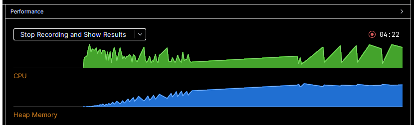
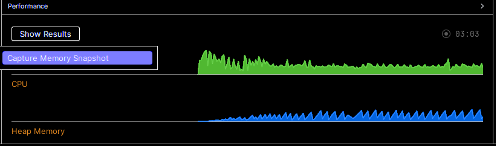
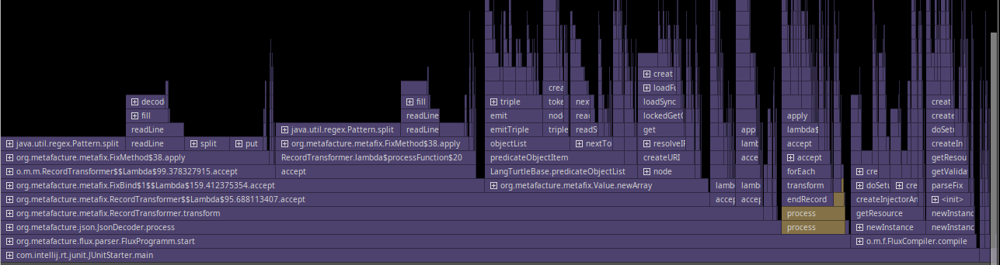

Some `metafacture-core` classes (e.g. the ubiquitous [`FileMap`](https://github.com/metafacture/metafacture-core/blob/master/metamorph/src/main/java/org/metafacture/metamorph/maps/FileMap.java) (which is invoked when loading a file as a table (like a CSV) in your ETL scripts)
used uncloseable resources, which would leak memory, [resulting ultimately in a
"OutOfMemoryError: Java heap space"](https://github.com/metafacture/metafacture-core/issues/666) since at least 2013 (back then the class was
 called `MapFile`).

## Preconditions

Affected were all usages of Metafacture which instantiate a `Flux` multiple times
over the lifecycle of one JVM. While this is an obvious statement, we could
experience the leaking of memory at the earliest since March 2021 when we
changed how to start our ETL processes for lobid-resources: Back in the early days we invoked
the ETL by starting a new JVM, run our workflow and terminate the JVM afterwards.
Coming with the [Webhook in March 2021](https://github.com/hbz/lobid-resources/issues/1159)
the JVM was not terminated after an ETL but listened further for incoming ETL
triggering. In principle the JVM should have only been restarted when new code
was to be deployed, but we soon discovered that restarting [our Play app](https://github.com/hbz/lobid-resources/tree/master/web)
just before the weekly fresh and complete ETL of > 24 million documents improved
the performance and averted some hanging processes or crashes.

We also have a monitoring tool installed on our servers which checks for terminated processes
and restarts them automatically. This happened often after some
more ETL processes were invoked (the "daily updates").
It was unclear why these crashes appeared but by assigning more RAM and 
(automatically) restarting the whole JVM after crashes the ETL process went
stable enough.

## Plotting the leak

Since 2025 we started the [Rheinland-Pfälzische Bibliografie (RPB)](https://github.com/hbz/rpb/).
Here, ETL processes are triggered _every time_ a record is changed or created.
This resulted very quickly in an
[OutOfMemoryError](https://github.com/hbz/lobid-resources/issues/2121#issuecomment-2631355294).

Using Intellij IDEA we can easily produce a picture which shows the ever
increasing demand of memory:

At the beginning (at the left) we see that the CPU (green colored) is heavily used
for all classes are compiled and loaded. Then we see how the Heap Memory (blue
colored) is filled and after some time there are some spikes, indicating that
the Garbage Collector was able to free some unused memory.
We can see how the memory
consumption is ascending nonetheless. Then a long line appears, lacking all
spikes. This happens when there is less and less memory which the
garbage collector could release. We can see 5 peaks where the CPU heavily
works - this is the garbage collector trying to find some piece of memory
to free - without much avail. The app crashes shortly after that (not to be
    seen).

## One fix, several problems solved

After [fixing the memory leak](https://github.com/metafacture/metafacture-core/commit/b32609307f75187a6a3822b8a951429c7fc924f3)
the consumption of memory is normal, i.e. not ascending:

Every spike indicates that memory resources were freed, resulting in a stable
rise and fall of CPU and memory usage. The memory leak is really fixed. 😀

Fixing the memory leak in Metafacture resolved some issues we've experienced:
- lobid-resources: daily updates sometimes aborted - although this was not such a big thing because our monitor scripts could "heal" the update process automatically (by restarting the app). However, the updates now don't take e.g. 4h (counting from triggering the update until the successful ETL) but 0.45m, which is way faster.
- Metafacture Playground: we had some [performance issues](https://github.com/metafacture/metafacture-playground/issues/194) which are now solved.
- RPB: a situation arose where we could only ever add more memory to our VMs to counteract a crash of cataloguing - always fearing that not too much documents were ETLed before the daily restart of the cataloguing app.

## How to and credits

It is _one_ thing to discover a memory leak, but another thing to
determine where the source of that leak _exactly_ is.
I have to thank e.g. [Chris Braithwaite for his excellent blog post concerning Java memory leaks](https://medium.com/@chrisbrat_17048/java-memory-leak-investigation-8add1314e33b) to gain a bit more of the background of what a Java memory leak is.
Very useful for me was the built-in profiler in Intellij IDEA. It not only
has helped to plot the graphs (see above) to see at a glance that there indeed is a
memory leak, but can also capture memory snapshots and profile the CPU usage
to find the problematic classes. It would show something like this:

If you have found the class where the memory leak most likely originates from
you can make an educated guess of the statement which causes the problem,
or/and by commenting in/out the likely code, tracking down the problematic code.
